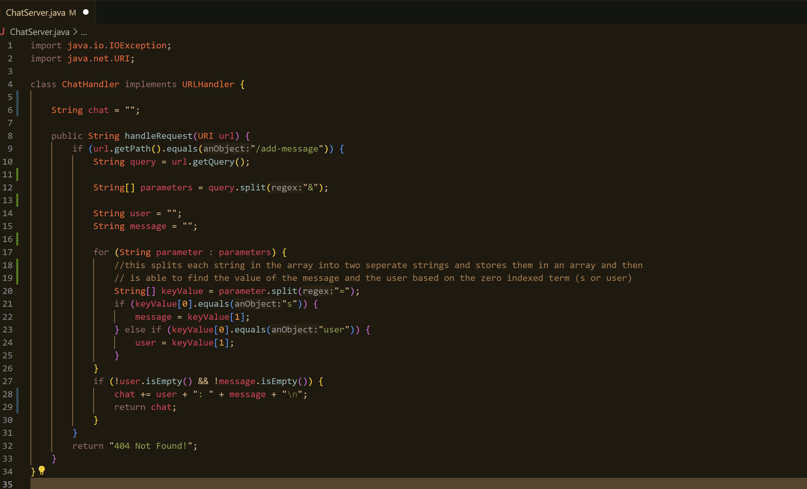

# This is lab report 2 for CSE 15 L - Noah Skinner

## Part 1 - `ChatServer` Implementation

Here is the code for my `ChatServer` :

.

.

To implement the server, I used ChatGPT to help me split the query to pull out the `message` string and the `user` string. 
Below are the prompt that was entered to ChatGPT and the resulting output. 
The code not pictured in the screenshot was not used as it did not pertain to the goal I needed to accomplish.

.

## Using the Server

Below is two instances of me using `/add-message` to add another chat to the server 

The first is adding the message 

