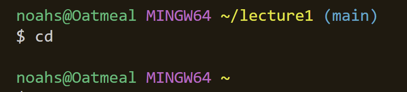
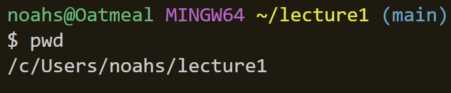

# This is lab report 1 for CSE 15L

## 1.1) - Using `cd` with no arguments

Using `cd` with no argument will return the user to the home directory.

The absolute path to the working directory before running the command was:
`/c/Users/noahs/lecture1`

This output is not an error.
