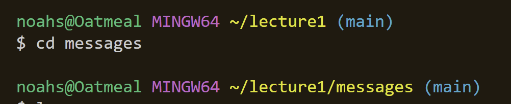
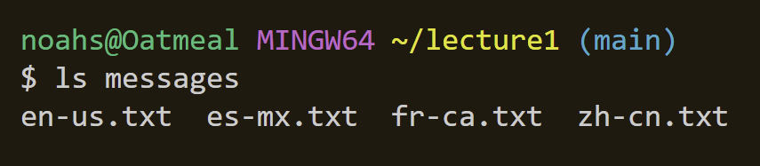

# This is lab report 1 for CSE 15L

## 1.1) - Using `cd` with no arguments

Using `cd` with no argument will return the user to the home directory.

The absolute path to the working directory before running the command was:
`/c/Users/noahs/lecture1`.

This is the expected output because using `cd` with no arguments is meant to return the user to the root directory
This output is not an error.

## 1.2) - Using `ls` with no arguments

Using `ls` with no arguments will list the files / folders in the given path.

The absolute path to the working directory before running the command was:
`/c/Users/noahs/lecture1` which was unchanged by the command.

I got this output because `ls` is meant to list the files / folders in a given path. Since my working directory was in `lecture1`, using `ls` listed all of the files and folders within `lecture1` which were `Hello.class`,  `Hello.java`,  `messages/`, and  `README`.

This output is not an error

## 1.3) - Using `cat` with no arguments

Using `cat` with no arguments will not produce any output immediatly. However, if one enters any text of command afterwards, it will simply return what the user types.

The absolute path to the working directory before running the command was:
`/c/Users/noahs/lecture1` which was unchanged by the command.

After looking up some documentation for the command, `cat` reads from standard input if there are no arguments provided. As I understand it, this is why it returns whatever I type after using the `cat` command.

This output is not an error. It follows exactly what the documentation describes. However, this caveat does not really have a great use for our situation.

## 2.1) - Using `cd` with a directory as an argument

Using `cd` with a directory as an argument will change the users working directory to the one provided as an argument

The absolute path to the working directory before the command was run was:
`/c/Users/noahs/lecture1` which was changed to `/c/Users/noahs/lecture1/messages` by the command.

I got this output because `cd` is used to switch the current working directory to the one provided. Since I provided `messages/` as the argument, the working directory was switched to `/c/Users/noahs/lecture1/messages`.

This is not an error. The command worked exactly as intended.

## 2.2) - Using `ls` with a directory as an argument

Using `ls` with a directory as an argument will list all of the files / folders in the directory.

The absolute path to the working directory before running the command was:
`/c/Users/noahs/lecture1` which was unchanged by the command.

I got this output because `ls` is meant to list the files and folders of the provided path. Since I used `messages` as the argument, the output was the files within `messages` (en-us.txt, .. etc).

