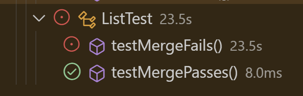

# This is lab report 3 for CSE 15L

## 1 - A failure inducing input in the form of a junit test
For the report, I chose the 'ListExamples' class, which has two buggy methods. I focused on the 'merge' method, which takes two lists and adds the contents to a 
new list with the first list being added entirely and then the second list being added entirely.

Here are the two tests. The testMergeFails fails and testMergePasses passes.
' @Test
    public void testMergeFails() {
        List<String> list1 = Arrays.asList("a", "c", "e");
        List<String> list2 = Arrays.asList("b", "d", "f", "g");  
        List<String> expected = Arrays.asList("a", "b", "c", "d", "e", "f", "g");
        List<String> result = ListExamples.merge(list1, list2);
        assertEquals(expected, result);'

  '@Test
    public void testMergePasses() {
        List<String> list1 = Arrays.asList("a", "c", "e");
        List<String> list2 = Arrays.asList("b", "d"); 
        List<String> expected = Arrays.asList("a", "b", "c", "d", "e");
        List<String> result = ListExamples.merge(list1, list2);
        assertEquals(expected, result);'

Here is the output of the two tests. There is no output on the terminal due to the bug in the method. The failure inducing input causes one of the tests to have an infinite loop, meaning I manually have to stop the tests from running.

.

Here is the buggy version of the method:
'while(index2 < list2.size()) {
      result.add(list2.get(index2));
      index1 += 1;
    }'

Here is the fixed version of the method:
'while(index2 < list2.size()) {
      result.add(list2.get(index2));
      index2 += 1;
    }'

This fix addresses the issue because the value of index2 never gets incremented in the buggy version. This means that the while loop will run without stopping since the conditonal will never evaluate to true. Changing it to index2 means that the value will properly increment and the conditional can be met.
    
