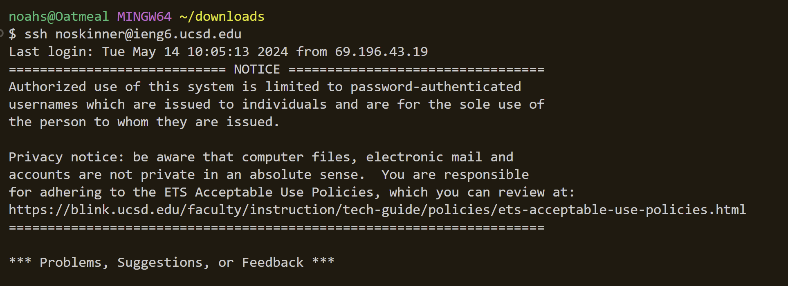

# Using vim

## Step 4 - 

The exact keys pressed for this step were:

`ssh<space>noskinner@iegn6.ucsd.edu<enter>`

I used the `ssh` command to start the program allowing me to access the ieng6 machine. I used a `<space>` to provide room for my argument, 
which was my username `noskinner` followed by the remote computer `ieng6@ucsd.edu`, followed by an `<enter>` to run the command.

## Step 5 - 

The exact keys pressed for this step were:

`git<space>clone<space>(<ctrl><v>)<enter>`

I used the `git` and `clone` commands spaced out with a `<space>` in order to tell the computer that I wanted to clone a github repository.
I used the `<ctrl>` and `<v>` keys in conjunction to paste the ssh repositry url I had copied on my clipboard. 
I then pressed `<enter>` to run this command and clone the repository into ieng6.

## Step 6 - 

The exact keys I pressed to get to this step were `cd<space>lab7<enter>` followed by `bash<space>test.sh<enter>`

I used the `cd` command followed by a `<space>` and the term `lab7` to change the working directory to `lab7`
I then used the `bash` command followed by a `<space>` to run the `test.sh` script, which ran the tests in `ListExamplesTests.java`.
The results of the tests showed that the `testMerge2` test failed.
