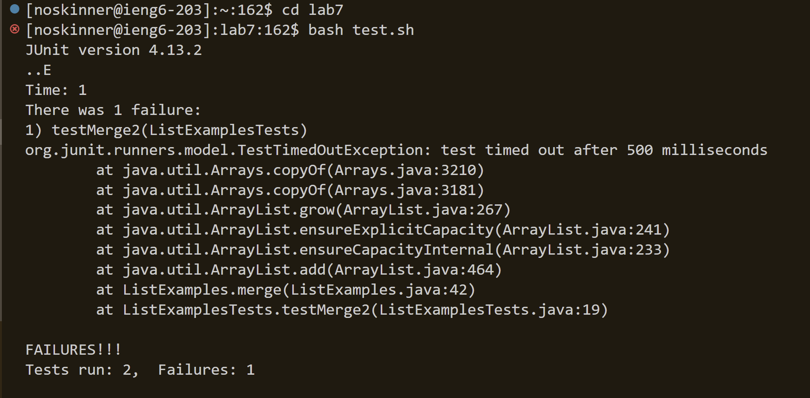
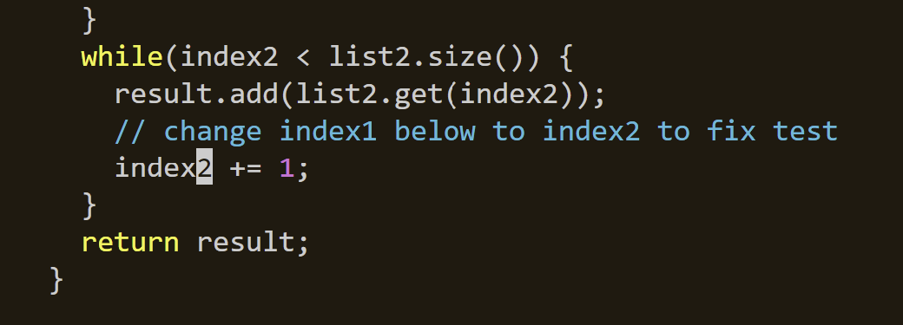

# Using vim

## Step 4 - 

The exact keys pressed for this step were:

`ssh<space>noskinner@iegn6.ucsd.edu<enter>`

I used the `ssh` command to start the program allowing me to access the ieng6 machine. I used a `<space>` to provide room for my argument, 
which was my username `noskinner` followed by the remote computer `ieng6@ucsd.edu`, followed by an `<enter>` to run the command.

## Step 5 - 

The exact keys pressed for this step were:

`git<space>clone<space>(<ctrl><v>)<enter>`

I used the `git` and `clone` commands spaced out with a `<space>` in order to tell the computer that I wanted to clone a github repository.
I used the `<ctrl>` and `<v>` keys in conjunction to paste the ssh repositry url I had copied on my clipboard. 
I then pressed `<enter>` to run this command and clone the repository into ieng6.

## Step 6 - 

The exact keys I pressed to get to this step were `cd<space>lab7<enter>` followed by `bash<space>test.sh<enter>`

I used the `cd` command followed by a `<space>` and the term `lab7` to change the working directory to `lab7`
I then used the `bash` command followed by a `<space>` to run the `test.sh` script, which ran the tests in `ListExamplesTests.java`.
The results of the tests showed that the `testMerge2` test failed.

## Step 7 -

The exact keys pressed were:
`vim<space>List<tab>.java<enter>` followed by `<escape>/index1<enter><n><n><n><n><n><n><n><n><n>` 
followed by `<l><l><l><l><l>r2>` followed by `<escape>:wq<enter>`

I used the `vim` command followed by a `<space>` and then typed List and the `<tab>` to autocomplete to ListExamples, then I typed .java to make sure it was the file I needed to alter and then hit `<enter>` to enter the vim editor.

Once in the vim editor, I typed `<escape>` to ensure I was in normal mode and then used the command `/` followed by index1 to find the first instance of the term "index1"
in `ListExamples.java`. I then pressed `n` nine times to find the instance of "index1" that I needed to change to fix the tests.

Doing so left the cursor at the start of the word so I hit `l` 5 times to move my cursor so that it was on the 1.

I then typed `r2`. The `r` is used to remove the character and the 2 is used to replace the character, meaning I changed the term
`index1` to `index2`.

I then pressed `<escape>` to ensure I was in normal mode and then typed `:wq` to save my changes and exit the vim editor.

## Step 8 -

The exact keys I pressed were `bash<space>test.sh<enter>`.

This was done to re-run the bash script that runs the tests for the `ListExamples.java` file.

I used the `bash` command followed by a `<space>` to run the `test.sh` script, which ran the tests in `ListExamplesTests.java`.
The results of the tests showed that both tests passed, meaning I fixed the error.

## Step 9 - 

git space commit Li tab .java
This space is space a space commit period
escape , :wq, enter
git space push enter

